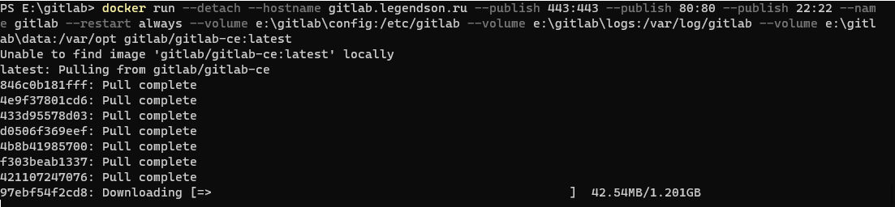
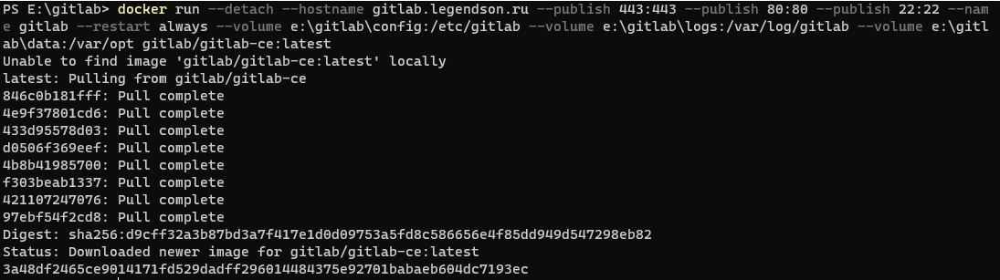
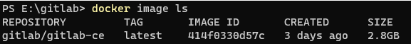
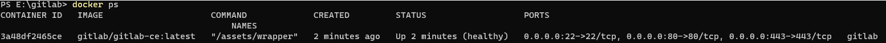
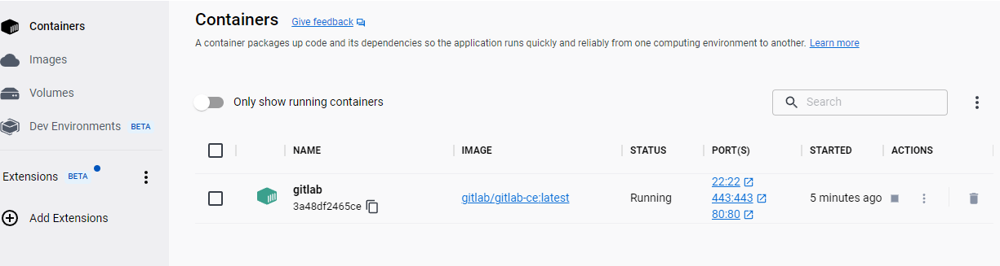
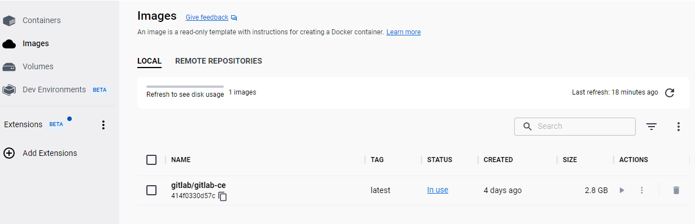
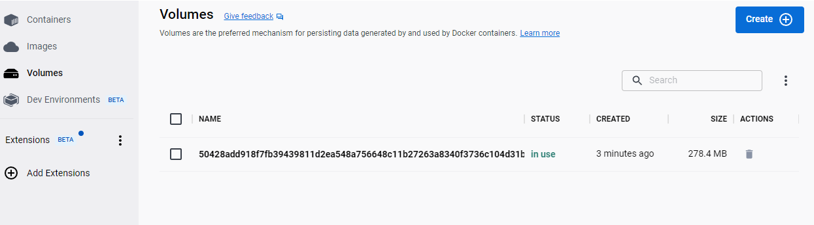
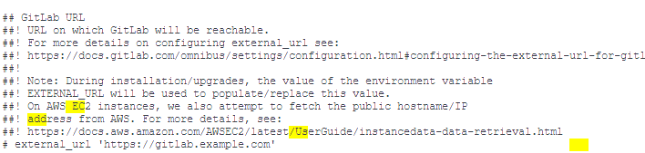
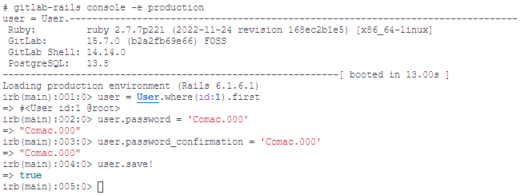
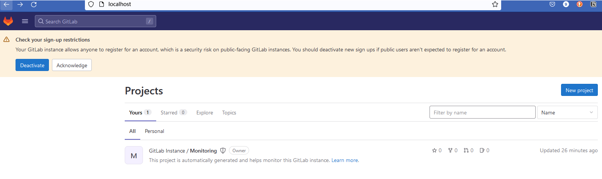

# Docker中安装GitLab

由于之前已经谈过了如果在虚拟机中安装GitLab的过程，本次Docker教程中，我们选择使用Docker来安装GitLab

在Windows上的Docker安装GitLab确实不如Linux上简单

> https://stackoverflow.com/questions/48057870/install-gitlab-on-windows-with-docker

按照Stackoverflow上的方案：
1. 我在E盘下新建了三个文件夹：
```html
e:\gitlab\config
e:\gitlab\logs
e:\gitlab\data
```

2. 然后输入以下命令
```bash
-------------------------------------------------------------------
docker run --detach --hostname localhost 
--publish 443:443 --publish 80:80 --publish 22:22 --name gitlab 
--restart always --volume e:\gitlab\config:/etc/gitlab 
--volume e:\gitlab\logs:/var/log/gitlab 
--volume e:\gitlab\data:/var/opt gitlab/gitlab-ce:latest
-------------------------------------------------------------------
```

3. 命令行开始运行如下




4. 执行完之后是会出来这样一个界面
	


	
5. 现在我们来看下docker中image 的情况和下辈子docker本身的情况，输入

```bash
---------------
docker image ls 
docker ps
---------------
```
	

	
	
	

6. 从上面来看，我们已经部署好了一个gitlab，这时候，我们去Docker desktop那边看一下，可以发现Containers、Images、Volumes里面已经有我们现在的内容了
	
	





	
	
7. 下面我们进入到gitlab的配置文件中，修改外部访问的URL，如下所示：

```bash

---------------
vi /etc/gitlab/gitlab.rb
gitlab-ctl reconfigure
---------------
```
	


8. 想要访问GitLab首页的话，在网址中输入`http://localhost` 即可
	 

	
9. 但是我这里居然提示不是管理员登录，奇怪，这时候我们去重置一下管理员账户：
	
	

10. 重置密码之后，我们重新刷新网页，ok，我们进来了，可以自己玩了
	
