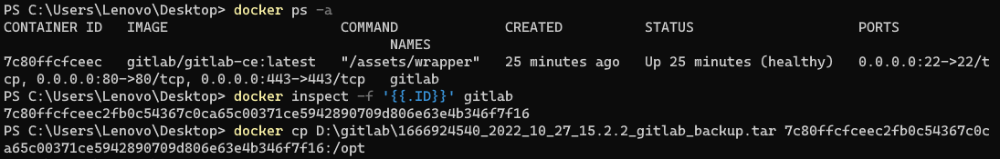

# Docker文件交换

假设一个场景，我们想要升级GitLab，那么我们就要做如下几步：
1. 备份数据
2. 升级GitLab版本
3. 恢复数据

其中GitLab的备份数据会存在/var/opt/gitlab/backups/...路径中，我们想要把它导出到外面，或者说我们想要导入一个外部文件，我们该怎么办呢？

```bash
---------------
docker cp outside_path containerId:inside_path   # docker文件导入
docker cp containerId:inside_path outside_path   # docker文件导出
---------------
```

上述命令中`path:outside_path`代表了docker外面的文件路径，`containerId`代表了Docker容器的ID，`inside_path`代表了docker内部的ID

Docker的容器有一个长ID，我们可以在Docker Desktop中看到，如下所示：


上图的7c80ff…就是这个长ID，当然我们在命令行中也获取到，

```bash
---------------
docker ps -a
docker inspect -f '{{.ID}}' gitlab
---------------
```

