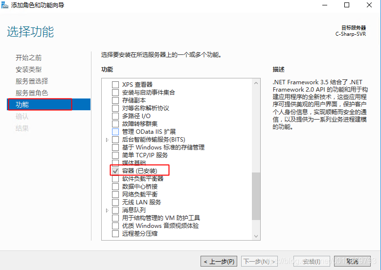

# Windows Server 下Docker的安装

Windows Server 下Docker的安装比较有意思：

由于工作需要，需要在内网中安装Docker 那么我们需要安装ee版本的Docker即可

> https://blog.csdn.net/u012869793/article/details/114288282

1. 下载ee版本的docker

> https://download.docker.com/components/engine/windows-server/19.03/docker-19.03.3.zip

2. 开启容器功能



3. 将下载后的文件解压拷贝到如下目录，并添加该目录为系统变量Path

```bash
C:\Program Files\Docker
```


4. 配置daemon.json文件

创建 `C:\ProgramData\Docker\config` 目录，在`config`目录下创建 `daemon.json` 文件，其内容可为
```json
{
"insecure-registries":[]
}
```

5. 将docker注册为服务
dockerd --register-service