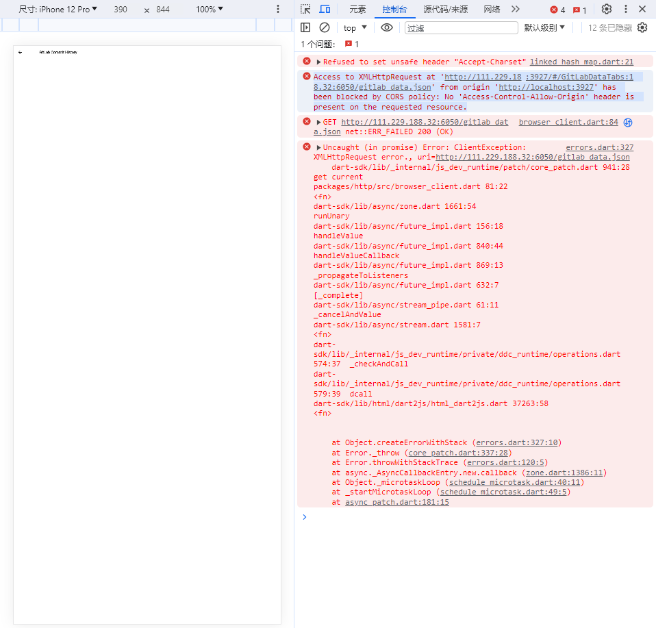

# Flutter QA

在Flutter项目开发过程中，会遇到一些问题，特此记录

## "Running Gradle task 'assembleDebug'... "

一般来说，Flutter项目调试Web都还好，但是开始实机调试的时候，我们往往会遇到一些问题，比如说

> "Running Gradle task 'assembleDebug'... "

这是因为Gradle需要下载内容，但是会一直卡住

解决方法参考如下

[flutter-app-stuck-at-running-gradle-task-assembledebug](
https://stackoverflow.com/questions/59516408/flutter-app-stuck-at-running-gradle-task-assembledebug)

1. Open your flutter Project directory.

打开flutter项目目录。

2. Change directory to android directory in your flutter project directory cd android

将目录更改为flutter项目目录中的android目录 cd android

3. clean gradle ./gradlew clean 清洁Gradle ./gradlew clean

4. Build gradle ./gradlew build or you can combine both commands with just ./gradlew clean build

构建gradle ./gradlew build ，或者您可以仅联合收割机 ./gradlew clean build 组合这两个命令

6. Now run your flutter project. If you use vscode, press F5. First time gradle running assembleDebug will take time.

现在运行您的Flutter项目。如果使用vscode，请按F5。第一次gradle运行assembleDebug将花费一些时间。

PS: Delete gradle in case of all that steps don't work

## Flutter Web CORS 跨域问题

出现如下问题

这是因为浏览器存在跨域问题导致的，我正好找到了一个ISSUE是关于这个的，我们来看看：

[Flutter Web API request has been blocked by CORS policy #83582](https://github.com/flutter/flutter/issues/83582)

下面一位的回答很有意思：

>The easiest method would be to enable CORS on the API and that solves the request for flutter. (Recommended)
最简单的方法是在API上启用CORS，这样就解决了抖动请求。（建议使用）
> 
>Or another solution would be to disable the web security in flutter itself ([StackoverFlow](https://stackoverflow.com/questions/65630743/how-to-solve-flutter-web-api-cors-error-only-with-dart-code/66879350#66879350))
或者另一种解决方案是禁用flutter本身的Web安全性（StackoverFlow）
> 
>Another alternative step would be to disable web security in chrome([StackOverflow](https://stackoverflow.com/questions/3102819/disable-same-origin-policy-in-chrome/6083677#6083677))
另一个替代步骤是禁用Chrome中的Web安全（StackOverflow）

## Windows 开发IOS应用

为了IOS开发和Android开发在同一场景下，我们或许需要在Windows下开发IOS应用，所以

[Windows上搭建MacOS系统为IOS开发做准备 ](https://juejin.cn/post/7151345400035672078)

跟着步骤：

1. 通过VMware Sation 和 Unlocker 以及MACOS镜像，在Windows上安装Macos的虚拟机；
2. 